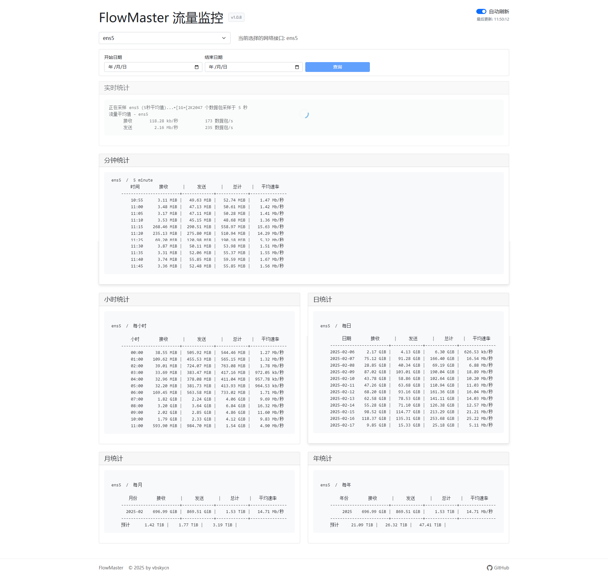

# FlowMaster - 开源的专业的网络流量监控系统

[](https://github.com/vbskycn/FlowMaster/blob/main/LICENSE)[](https://github.com/vbskycn/FlowMaster/stargazers)[](https://github.com/vbskycn/FlowMaster/issues)



## 📝 项目介绍

FlowMaster 是一个基于 vnstat 的专业网络流量监控系统，提供实时流量统计、历史数据分析等功能。系统采用现代化的 Web 界面，支持多网卡监控，让网络流量监控变得简单而强大。

### ✨ 主要特性

- 🚀 实时流量监控
- 📊 多维度数据统计（分钟、小时、日、月、年）
- 🌐 多网卡支持
- 🎯 自动刷新功能
- 📱 响应式设计，支持移动端
- 🌙 现代深色主题
- 🔄 数据自动更新

## 🛠️ 技术栈

| 组件 | 技术 |
|-----------|------------|
| 后端框架 | Node.js + Express |
| 前端框架 | Vue 3 + Bootstrap 5 |
| 监控工具 | vnstat |
| 接口类型 | RESTful API |

## 📦 安装部署

### 环境要求

| 组件 | 版本 |
|-----------|---------|
| Node.js | 14.0.0 或更高版本 |
| vnstat | 2.0.0 或更高版本 |
| 包管理器 | npm 或 yarn |
| Docker (可选) | 20.10.0 或更高版本 |
| Docker Compose (可选) | 2.0.0 或更高版本 |

### Docker 部署

#### 方法一：使用预构建的 Docker 镜像（推荐）

创建 `docker-compose.yml` 文件：

```yaml
version: '3'

services:
  flowmaster:
    image: vbskycn/flowmaster:latest
    container_name: flowmaster
    restart: always
    ports:
      - "10089:10089"
    volumes:
      - vnstat_data:/var/lib/vnstat
    network_mode: "host" # 使用主机网络模式以便监控主机网络接口
    privileged: true # 使用特权模式以获取网络接口信息

volumes:
  vnstat_data:
```

然后运行：

```bash
docker-compose up -d
```

#### 方法二：从源码构建 Docker 镜像

##### 1. 克隆项目

```bash
git clone https://github.com/vbskycn/FlowMaster.git
cd FlowMaster
```

##### 2. 使用 Docker Compose 构建并启动

```bash
docker-compose up -d
```

这将自动构建Docker镜像并在后台启动容器。

#### 3. 访问服务

安装完成后，通过浏览器访问：`http://服务器IP:10089`

> 注意：请确保防火墙已放行 10089 端口

#### 4. 查看容器日志

```bash
docker logs flowmaster
```

#### 5. 停止服务

```bash
docker-compose down
```

#### 6. 更新服务

```bash
# 进入项目目录
cd FlowMaster

# 拉取最新代码
git pull

# 重新构建并启动
docker-compose up -d --build
```

### 一键部署（传统方式）

```bash
curl -o install.sh https://raw.githubusercontent.com/vbskycn/FlowMaster/main/install.sh && chmod +x install.sh && sudo ./install.sh
```

国内机器
不行自己换加速地址
```bash
curl -o install.sh https://gh-proxy.com/https://raw.githubusercontent.com/vbskycn/FlowMaster/main/install.sh && chmod +x install.sh && sudo ./install.sh
```

如果一键安装失败建议使用手动pm2部署，可以看到是哪一步出了问题

### 常用命令

启动服务:
```bash
flowmaster start
```

停止服务:
```bash
flowmaster stop
```

重启服务:
```bash
flowmaster restart
```

查看状态:
```bash
flowmaster status
```

卸载服务:
```bash
flowmaster uninstall
```

### 访问方式

安装完成后，通过浏览器访问：`http://服务器IP:10089`

> 注意：请确保防火墙已放行 10089 端口

### 手动安装步骤

#### 1. 安装 vnstat

```bash
# Debian/Ubuntu
sudo apt-get install vnstat

# CentOS
sudo yum install vnstat
```

#### 2. 安装 PM2
```bash
# 全局安装 PM2
sudo npm install -g pm2

# 设置 PM2 开机自启
sudo pm2 startup
```

#### 3. 克隆项目

```bash
git clone https://github.com/vbskycn/FlowMaster.git
cd FlowMaster
```

#### 4. 安装依赖

```bash
npm install
# 或
yarn install
```

#### 5. 使用 PM2 启动服务

```bash
# 启动服务
pm2 start server.js --name flowmaster

# 保存 PM2 配置
pm2 save
```

#### 6. PM2 管理命令

```bash
# 查看服务状态
pm2 status flowmaster

# 查看服务日志
pm2 logs flowmaster

# 重启服务
pm2 restart flowmaster

# 停止服务
pm2 stop flowmaster

# 删除服务
pm2 delete flowmaster

# 查看详细信息
pm2 show flowmaster

# 监控服务
pm2 monit
```

默认访问地址：`http://localhost:10089`

#### 7.更新脚本

```bash
cd FlowMaster #进入脚本目录
git pull #更新仓库
pm2 restart flowmaster #重启flowmaster进程
```

### 🔧 配置说明

使用 PM2 设置环境变量：

```bash
# 设置端口
pm2 start server.js --name flowmaster --env PORT=8080

# 或在 ecosystem.config.js 中配置
echo 'module.exports = {
  apps: [{
    name: "flowmaster",
    script: "server.js",
    env: {
      PORT: 8080
    }
  }]
}' > ecosystem.config.js

# 使用配置文件启动
pm2 start ecosystem.config.js
```

## 📖 使用说明

1. 系统启动后，自动检测可用网卡
2. 在界面上选择要监控的网卡
3. 查看实时流量和历史统计数据
4. 可开启自动刷新功能，实时更新数据

## 🤝 贡献指南

欢迎提交 Issue 和 Pull Request！

1. Fork 本项目
2. 创建新分支：`git checkout -b feature/AmazingFeature`
3. 提交更改：`git commit -m 'Add some AmazingFeature'`
4. 推送分支：`git push origin feature/AmazingFeature`
5. 提交 Pull Request

## 📄 开源协议

本项目采用 MIT 协议开源，详见 [LICENSE](LICENSE) 文件。

## 👨‍💻 作者

**vbskycn**

- GitHub: [@vbskycn](https://github.com/vbskycn)

## 🙏 致谢

- [vnstat](https://github.com/vergoh/vnstat) - 强大的网络流量监控工具
- [Vue.js](https://vuejs.org/) - 渐进式 JavaScript 框架
- [Bootstrap](https://getbootstrap.com/) - 流行的前端组件库

## 📞 联系方式

如有问题或建议，欢迎通过以下方式联系：

- 提交 [Issue](https://github.com/vbskycn/FlowMaster/issues)
- 访问我的 [GitHub 主页](https://github.com/vbskycn)

---

如果这个项目对你有帮助，欢迎 star ⭐️ 